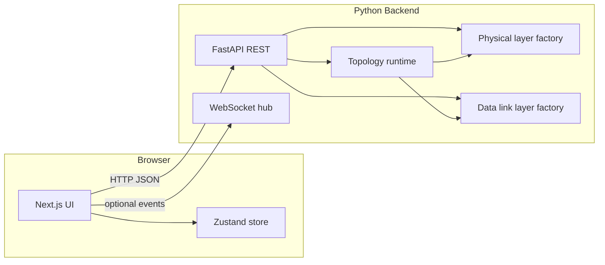

# ITL351 — NetSim: Specification Document

**Course:** ITL351 — Computer Networks Lab  
**Assignment:** Semester Project — Submission 1 (document dated February 25, 2026)  
**Submission deadline:** March 25, 2026 (via Gradescope, per course notice)  
**Project title:** Network simulator implementing the protocol stack (Physical + Data Link for this submission)

**Implementation:** NetSim v2.0  
**Repository layout:** `frontend/` (Next.js 14 + TypeScript) · `backend/` (Python FastAPI) · WebSockets for live events

**Group:** *(add names; max 4 students per course rules)*

This document is the **formal specification** required by the assignment: it describes design choices, I/O representation, formats, and what is implemented. It should be **updated with each submission**.

---

## 1. Assignment alignment (Submission 1)

The course project is **open-ended** (language, UI, formats). This section maps **ITL351 Submission 1** objectives to **this codebase**.

### 1.1 Physical layer (course minimum deliverables)

| Course requirement | How NetSim satisfies it |
|--------------------|-------------------------|
| Creating **end devices** and **hubs** | UI palette: place **host** (end device) and **hub**; labels, MAC/IP editable. |
| **Connections** forming a **topology** | User draws links between devices; **wired** vs **wireless**; presets (e.g. star, demo). |
| **Sending and receiving data** | **Simulate** runs PHY or DLL simulation; backend emits send/receive events (`BITS_SENT`, `FRAME_SENT`, `FRAME_RECEIVED`, topology `SESSION_INFO`, etc.). |

### 1.2 Data link layer (course minimum deliverables)

| Course requirement | How NetSim satisfies it |
|--------------------|-------------------------|
| Layer 2 devices: **bridge** and **switch** | **Switch** implemented with MAC learning and forwarding. A **bridge** is not a separate icon; *switch behavior in this project fulfills the L2 learning bridge/switch requirement* (transparent bridge semantics via the switch role). **Hub** is L1 repeat; included for PHY test cases. |
| **Address learning** (switch) | Per-switch MAC→port table; learning on ingress; persists per backend **session** until topology fingerprint changes or **Reset tables**. |
| At least one **error control** protocol | e.g. **CRC-32**, **checksum**, optional inject error — selectable in DLL config / API. |
| At least one **access control** protocol | e.g. **CSMA/CD**, **CSMA/CA**, CSMA, ALOHA variants — selectable. |
| At least one **sliding-window flow control** protocol | **Go-Back-N** and **Selective Repeat** (window size configurable); also Stop-and-Wait. |

### 1.3 Course test cases (mapping)

**PHY — two end devices, dedicated link, data transmission**  
- Build two **hosts**, one **link**, set **SRC/DST**, run **Simulate** (PHY or DLL mode).  
- *Simulation only* — no real network traffic; matches assignment note.

**PHY — star: five end devices + hub, hub semantics**  
- Load **Star** preset or place one **hub** and five **hosts**, link each host to the hub, assign SRC/DST among hosts, run simulation.  
- **Hub** role **floods** to all ports except ingress (`HubRole` in `topology_runtime.py`).

**DLL — one switch, five end devices, transmission, access + flow control, broadcast/collision domains**  
- Place **one switch**, five **hosts**, all connected to the switch; run **datalink** topology mode with chosen **MAC** and **flow** options.  
- Sidebar shows **broadcast/collision domain** counts from backend (`domain_stats`).  
- **Switch MAC tables** panel shows learning; event log shows DLL/PHY events.

**DLL — two stars (hub + five hosts each), hubs connected by a switch, ten hosts, domains**  
- Build manually: two hubs, each with five hosts, one **switch** between the two hubs, links as required; run simulation and read **domain_stats** in the API response / UI.  
- *Grader note:* exact topology is user-constructed on canvas; presets do not auto-build this 10-host layout.

---

## 2. Possible add-ons (course list) — status

| Add-on (from PDF) | Status in NetSim |
|-------------------|------------------|
| PHY: bits, line coding, **signal** display | **Yes** — bit string / message → encoding; **Canvas** waveform; encodings e.g. NRZ, Manchester, AMI, 4B5B (`GET /api/encodings`). |
| PHY: **topology** of network | **Yes** — graphical canvas with devices and links. |
| DLL: **noise** / error models | **Partial** — BER dropdown, collision probability, inject error for CRC/checksum demos; not a full continuous noise channel model. |
| More error / correction / MAC / flow techniques | **Partial** — multiple schemes via factories; not exhaustive. |

---

## 3. Purpose and product scope

### 3.1 Goal

Educational simulator: **Physical** and **Data Link** layers with **graphical topology**, **REST API**, optional **WebSocket** event stream, and **topology-aware** L2 forwarding (hosts, hubs, switches).

### 3.2 In scope (implemented)

- Physical: line encoding, signal samples/events, wired/wireless medium in API/UI.  
- Data link: framing, error control, MAC, ARQ flow control; multi-node **topology runtime** with switch learning and domain statistics.  
- Web UI: editor, waveform panel, event log, switch MAC table view, resizable panels.

### 3.3 Out of scope / stubs

- **Network, Transport, Application** — event types and UI placeholders; **not** full end-to-end stack in this submission.  
- Not bit-accurate real-time Ethernet PHY timing (educational stepping).

---

## 4. System architecture



- **Frontend:** `/` landing, `/simulator` main UI; `NEXT_PUBLIC_BACKEND_URL`, `NEXT_PUBLIC_WS_URL` for API/WebSocket.  
- **Backend:** `POST /api/simulate/physical`, `POST /api/simulate/datalink`; topology packaged in datalink request when `topology_devices` / `topology_links` are set (`simulate_datalink_topology`).

---

## 5. Technology stack

| Component | Technology |
|-----------|------------|
| Frontend | Next.js 14, React 18, TypeScript, Zustand |
| Backend | Python 3, FastAPI, Pydantic v2, Uvicorn |
| Real-time | WebSockets `/ws/{session_id}` |
| Tests | Frontend: Vitest; Backend: `pytest` in `backend/tests/` |

---

## 6. TCP/IP model (UI convention)

Four-layer **TCP/IP** presentation: Application (incl. session/presentation), Transport, Network, Data Link, Physical — **Physical** and **Data Link** are **live** in this build.

---

## 7. Functional specification (technical)

### 7.1 Physical layer

- Encodings from `PhysicalLayerFactory` — `GET /api/encodings`.  
- Media — `GET /api/media` (`wired`, `wireless`).  
- `POST /api/simulate/physical`: bit string, encoding, medium, clock/samples — events `BITS_SENT`, `SIGNAL_DRAWN`, etc.

### 7.2 Data link layer

- Options — `GET /api/datalink/options` (framing, error, `mac_proto`, flow).  
- Framing: variable (HDLC-style) and fixed-size; error: CRC-32, checksum, none; MAC: ALOHA, CSMA, CSMA/CD, CSMA/CA; flow: stop-and-wait, GBN, selective repeat.

### 7.3 Topology runtime (`backend/simulation/topology_runtime.py`)

- Graph from devices + links.  
- **Host:** route toward destination along graph.  
- **Switch:** learn source MAC on port; unicast if known; flood unknown unicast and broadcast.  
- **Hub:** flood except ingress.  
- Session **switch_tables**; fingerprint reset; `reset_learning` flag.  
- Returns `domain_stats`, `switch_tables`, `learning_summary`, `switch_ports`.

### 7.4 Events

- `SimEvent` model (`backend/simulation/events.py`); WebSocket broadcast when clients connected.

### 7.5 Frontend (simulator)

- Topology editing, presets, PHY/DLL modes, DLL config, waveform (Canvas), event log, MAC tables (scrollable), overlay stacking for tooltips/menus.

---

## 8. REST API summary

| Method | Path | Purpose |
|--------|------|---------|
| GET | `/health` | Health |
| GET | `/api/encodings` | Encodings |
| GET | `/api/media` | Media |
| GET | `/api/datalink/options` | DLL keys |
| POST | `/api/simulate/physical` | Physical run |
| POST | `/api/simulate/datalink` | DLL run (+ optional topology) |
| WS | `/ws/{session_id}` | Event stream |

Schemas: `PhysicalSimReq`, `DataLinkSimReq` in `backend/main.py`.

---

## 9. Design patterns (backend)

Strategy (encoding, medium, framing, error, MAC, flow), Template Method (layers), Observer (events), Factory (layers/devices).

---

## 10. Limitations

- Higher layers stubbed.  
- Topology forwarding is educational (loop guards; not industrial STP).  
- Local `npm run dev` may warn if `registry.npmjs.org` is unreachable; server often still starts.

---

## 11. How to run (for graders)

```bash
# Backend
cd backend && pip install -r requirements.txt && uvicorn main:app --reload --port 8000

# Frontend
cd frontend && npm install && npm run dev
# → http://localhost:3000/simulator
```

```bash
cd backend && pytest
```

---

## 12. Document history

| Version | Date | Notes |
|---------|------|--------|
| 1.0 | — | Initial NetSim technical spec |
| 2.0 | — | **Aligned with ITL351 Semester Project Submission 1 PDF** (objectives, deliverables, test-case mapping, add-ons) |

*Update this file on each submission per course instructions.*
